# Highlight Themes

- [`abap`](#abap)
- [`algol`](#algol)
- [`algol_nu`](#algol_nu)
- [`arduino`](#arduino)
- [`autumn`](#autumn)
- [`average`](#average)
- [`base16-snazzy`](#base16-snazzy)
- [`borland`](#borland)
- [`bw`](#bw)
- [`catppuccin-frappe`](#catppuccin-frappe)
- [`catppuccin-latte`](#catppuccin-latte)
- [`catppuccin-macchiato`](#catppuccin-macchiato)
- [`catppuccin-mocha`](#catppuccin-mocha)
- [`colorful`](#colorful)
- [`doom-one`](#doom-one)
- [`doom-one2`](#doom-one2)
- [`dracula`](#dracula)
- [`emacs`](#emacs)
- [`friendly`](#friendly)
- [`fruity`](#fruity)
- [`github`](#github)
- [`github-dark`](#github-dark)
- [`gruvbox`](#gruvbox)
- [`gruvbox-light`](#gruvbox-light)
- [`hr_high_contrast`](#hr_high_contrast)
- [`hrdark`](#hrdark)
- [`igor`](#igor)
- [`lovelace`](#lovelace)
- [`manni`](#manni)
- [`modus-operandi`](#modus-operandi)
- [`modus-vivendi`](#modus-vivendi)
- [`monokai`](#monokai)
- [`monokailight`](#monokailight)
- [`murphy`](#murphy)
- [`native`](#native)
- [`noop`](#noop)
- [`nord`](#nord)
- [`onedark`](#onedark)
- [`onesenterprise`](#onesenterprise)
- [`paraiso-dark`](#paraiso-dark)
- [`paraiso-light`](#paraiso-light)
- [`pastie`](#pastie)
- [`perldoc`](#perldoc)
- [`pygments`](#pygments)
- [`rainbow_dash`](#rainbow_dash)
- [`rose-pine`](#rose-pine)
- [`rose-pine-dawn`](#rose-pine-dawn)
- [`rose-pine-moon`](#rose-pine-moon)
- [`rrt`](#rrt)
- [`solarized-dark`](#solarized-dark)
- [`solarized-dark256`](#solarized-dark256)
- [`solarized-light`](#solarized-light)
- [`swapoff`](#swapoff)
- [`tango`](#tango)
- [`trac`](#trac)
- [`vim`](#vim)
- [`vs`](#vs)
- [`vulcan`](#vulcan)
- [`witchhazel`](#witchhazel)
- [`xcode`](#xcode)
- [`xcode-dark`](#xcode-dark)

## `abap`

## `algol`

## `algol_nu`

## `arduino`

## `autumn`

## `average`

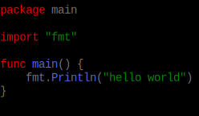

## `base16-snazzy`

## `borland`

## `bw`

## `catppuccin-frappe`

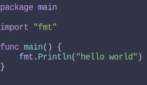

## `catppuccin-latte`

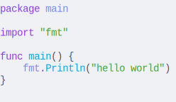

## `catppuccin-macchiato`

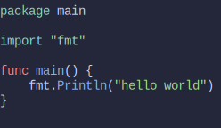

## `catppuccin-mocha`

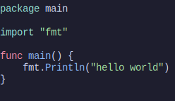

## `colorful`

## `doom-one`

## `doom-one2`

## `dracula`

## `emacs`

## `friendly`

## `fruity`

## `github`

## `github-dark`

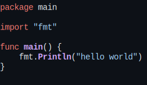

## `gruvbox`

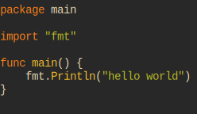

## `gruvbox-light`

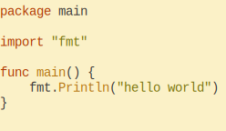

## `hr_high_contrast`

## `hrdark`

## `igor`

## `lovelace`

## `manni`

## `modus-operandi`

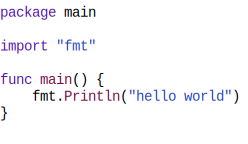

## `modus-vivendi`

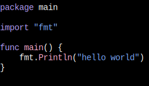

## `monokai`

## `monokailight`

## `murphy`

## `native`

## `noop`

## `nord`

## `onedark`

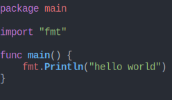

## `onesenterprise`

## `paraiso-dark`

## `paraiso-light`

## `pastie`

## `perldoc`

## `pygments`

## `rainbow_dash`

## `rose-pine`

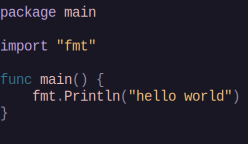

## `rose-pine-dawn`

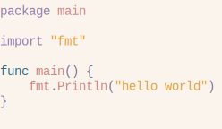

## `rose-pine-moon`

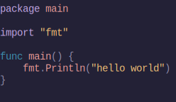

## `rrt`

## `solarized-dark`

## `solarized-dark256`

## `solarized-light`

## `swapoff`

## `tango`

## `trac`

## `vim`

## `vs`

## `vulcan`

## `witchhazel`

## `xcode`

## `xcode-dark`

