# Highlight Themes

- [`abap`](#abap)
- [`algol`](#algol)
- [`algol_nu`](#algol_nu)
- [`arduino`](#arduino)
- [`autumn`](#autumn)
- [`base16-snazzy`](#base16-snazzy)
- [`borland`](#borland)
- [`bw`](#bw)
- [`colorful`](#colorful)
- [`doom-one`](#doom-one)
- [`doom-one2`](#doom-one2)
- [`dracula`](#dracula)
- [`emacs`](#emacs)
- [`friendly`](#friendly)
- [`fruity`](#fruity)
- [`github`](#github)
- [`hr_high_contrast`](#hr_high_contrast)
- [`hrdark`](#hrdark)
- [`igor`](#igor)
- [`lovelace`](#lovelace)
- [`manni`](#manni)
- [`monokai`](#monokai)
- [`monokailight`](#monokailight)
- [`murphy`](#murphy)
- [`native`](#native)
- [`nord`](#nord)
- [`onesenterprise`](#onesenterprise)
- [`paraiso-dark`](#paraiso-dark)
- [`paraiso-light`](#paraiso-light)
- [`pastie`](#pastie)
- [`perldoc`](#perldoc)
- [`pygments`](#pygments)
- [`rainbow_dash`](#rainbow_dash)
- [`rrt`](#rrt)
- [`solarized-dark`](#solarized-dark)
- [`solarized-dark256`](#solarized-dark256)
- [`solarized-light`](#solarized-light)
- [`swapoff`](#swapoff)
- [`tango`](#tango)
- [`trac`](#trac)
- [`vim`](#vim)
- [`vs`](#vs)
- [`vulcan`](#vulcan)
- [`witchhazel`](#witchhazel)
- [`xcode`](#xcode)
- [`xcode-dark`](#xcode-dark)

## `abap`

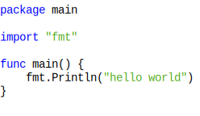

## `algol`

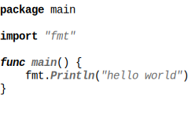

## `algol_nu`

## `arduino`

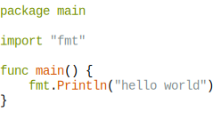

## `autumn`

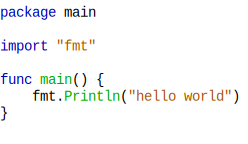

## `base16-snazzy`

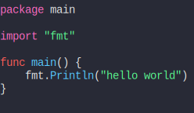

## `borland`

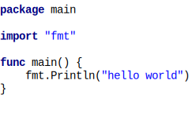

## `bw`

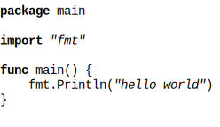

## `colorful`

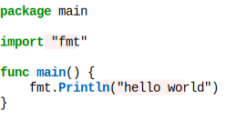

## `doom-one`

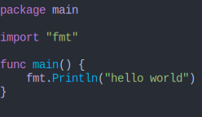

## `doom-one2`

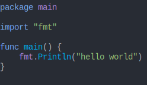

## `dracula`

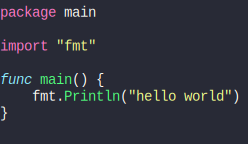

## `emacs`

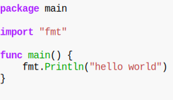

## `friendly`

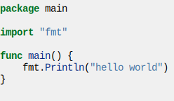

## `fruity`

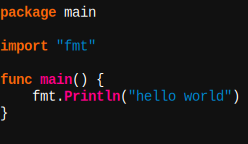

## `github`

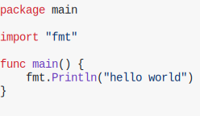

## `hr_high_contrast`

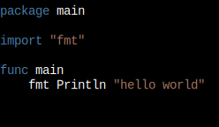

## `hrdark`

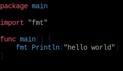

## `igor`

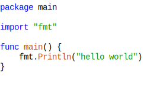

## `lovelace`

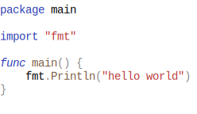

## `manni`

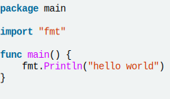

## `monokai`

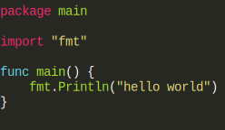

## `monokailight`

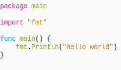

## `murphy`

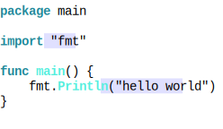

## `native`

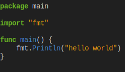

## `nord`

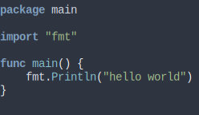

## `onesenterprise`

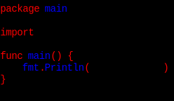

## `paraiso-dark`

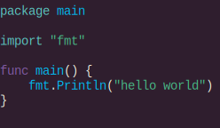

## `paraiso-light`

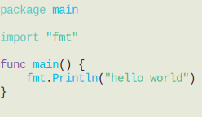

## `pastie`

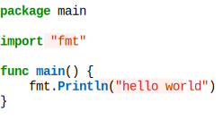

## `perldoc`

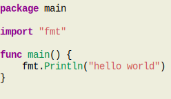

## `pygments`

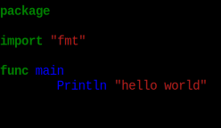

## `rainbow_dash`

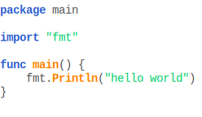

## `rrt`

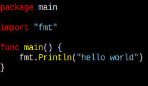

## `solarized-dark`

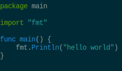

## `solarized-dark256`

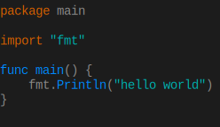

## `solarized-light`

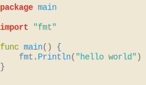

## `swapoff`

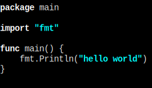

## `tango`

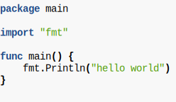

## `trac`

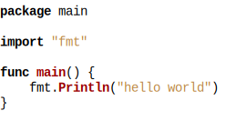

## `vim`

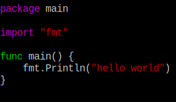

## `vs`

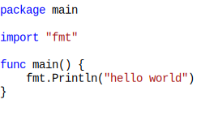

## `vulcan`

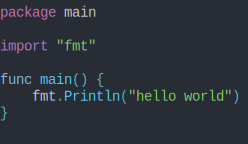

## `witchhazel`

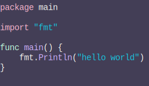

## `xcode`

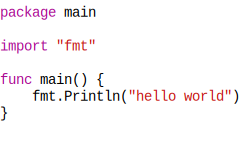

## `xcode-dark`

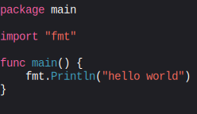

